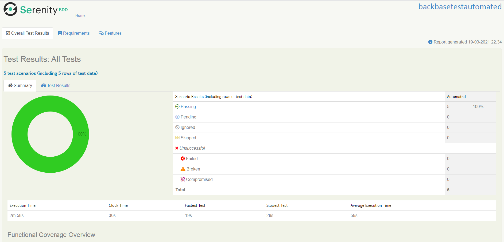
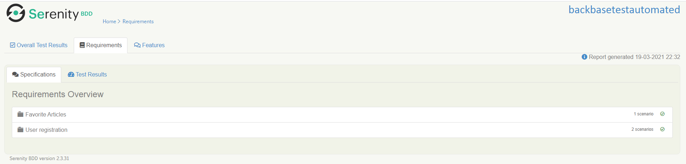
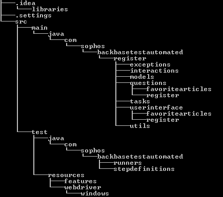
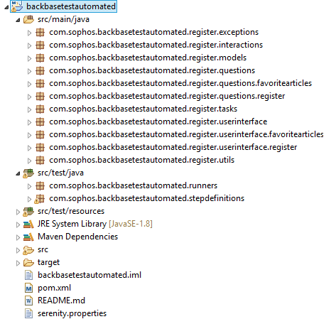

PROJECT TEST AUTOMATED BACKBASE
===============================
Content
-------

1.  Summary project
2.  second_item


Summary project
-------------------------------
This is a project that contains the tests proposed by the Backbase company, this uses the Serenity bdd framework integrated with cucumber. The Gherkin language is used as for the documentation of test cases, the Cucumber library that is included within the Serenity framework for natural language interpretation and the ScreenPlay design pattern that internally uses the PageObject design pattern.


How to run the project
--------------
To run all test cases in the project run the command

|Name scenario or description |Tag|commant|
|:-------:|:-------:|:-------:|
|Run all test||mvn clean verify|
|Successful registration|@Register_Succesful|mvn clean verify -Dtags="@Register_Succesful"|
|Registration failed by username|@Register_Failed_user|mvn clean verify -Dtags="@Register_Failed_user"|
|List of articles followed successful|@ListOfFavoriteArticles|mvn clean verify -Dtags="@ListOfFavoriteArticles"|

Test scenarios
-----------------------

Reports of the tests executed
-----------------------
In this session we are going to observe where to find the evidence of the last execution and its respective results.


##### Path in the project

./target/site/serenity/index.html


##### View main report

 


##### View Requirements Overview 

 


##### Features in the report
 


Project structure
-----------------------
The following image shows the basic structure of the folders that make up the project  

 
  
 


Non-automated functionalities some test scripts
---------------------------------------------

This is an example of two test scenarios, each scenario has a test script and the possible test values

```Gherkin
@Comments_smoke
Feature: Comments on Articles
  I want to use this template for my feature file

  Background: 
    Given the name actor "New User"
    Then the browser opens
    Given a username "candidatex" and a password "qa-is-cool" I want to enter the portal of the BBlog page

  @CreateComment
  Scenario Outline: Create a commet
    When I go to the Sign up option
    Then I verify the if i can to see the label <mainLabel>
    When the form is filled with the user "<userName>" email "<email>" and password "<password>" and makes the registration
    When you see the Global Feed tab I will enter this
    And I will look for the article with the title "<articleTitle>" and I will click on read more
    Then validate that it is inside the article
    When you post the comment with the message "<comment>"
    Then validate that the comment "<comment>" exists

    Examples: 
      | mainLabel | userName    | email                      | password    | articleTitle | comment       |
      | Sign in   | testsophos2 | testsophos2@testsophos.com | testsophos1 | example 1    | comment one   |
      | Sign in   | testsophos2 | testsophos2@testsophos.com | testsophos1 | example 2    | comment two   |
      | Sign in   | testsophos2 | testsophos2@testsophos.com | userHsdssfa | example 3    | comment three |


  @DeleteComment
  Scenario Outline: Detele a commet
    When I go to the Sign up option
    Then I verify the if i can to see the label "<mainLabel>"
    When the form is filled with the user "<userName>" email "<email>" and password "<password>" and makes the registration
    When you see the Global Feed tab I will enter this
    And I will look for the article with the title "<articleTitle>" and I will click on read more
    Then validate that it is inside the article
    When you post the comment with the message "<comment>"
    Then validate that the comment "<comment>" exists
    When you delete the created comment "<comment>"
    Then validate that the comment "<comment>" does not exist

    Examples: 
      | mainLabel | userName    | email                      | password    | articleTitle | comment              |
      | Sign in   | testsophos2 | testsophos2@testsophos.com | testsophos1 | example 1    | comment one delete   |
      | Sign in   | testsophos2 | testsophos2@testsophos.com | testsophos1 | example 2    | comment two delelte  |
      | Sign in   | testsophos2 | testsophos2@testsophos.com | userHsdssfa | example 3    | comment three delete |

```

Non-functional system requirements
--------------
- Maven 3.6.3
- Java 1.8
- Google chrome with version 89.0.4389.90
- Windows 8 or higher operating system


Autor
------------
&copy; Eder Leandro Carbonero Baquero